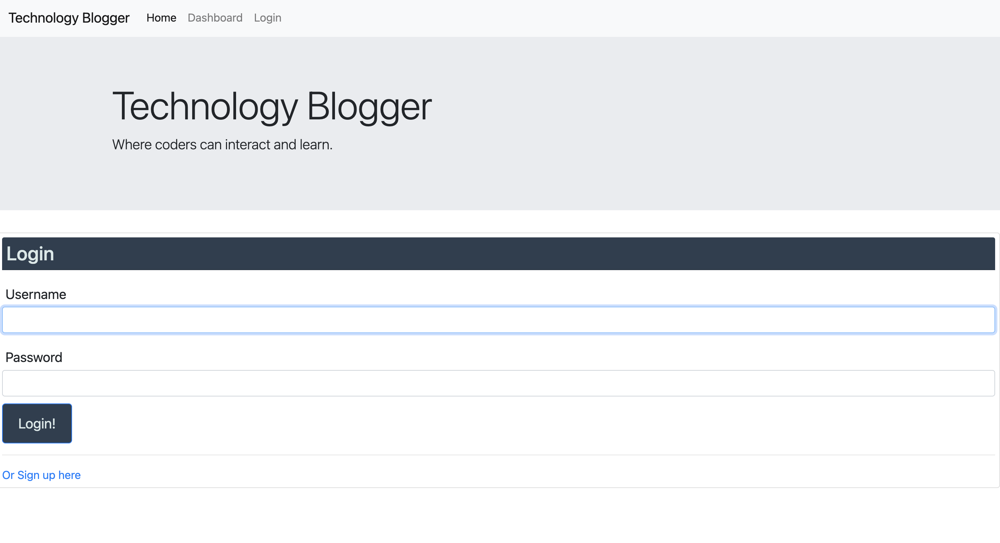
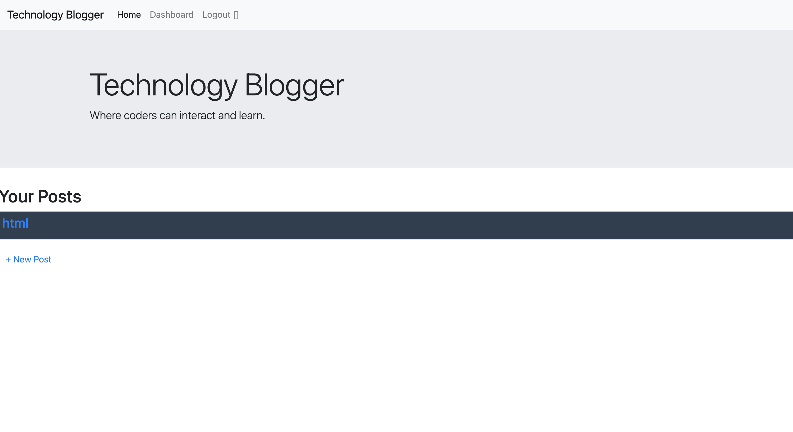

# Technology Blogger

In this application the first page is a login, to get access with your user name and password.
In the second page if you don't have a login you will have the option to sign up.
In the dashboard you will be able to view the posts.
You can click on the post to view the information and also when you do that you can update and edit the post.
Then when you are done you can click sign out.

# Technologies

The technologies used to build this application are the following.

- express.js
- node.js
- MysQl
- handlebars
- heroku (deployment)

# Links
https://technology-blogger-c7caaeb21ba8.herokuapp.com/signup 

# Images

